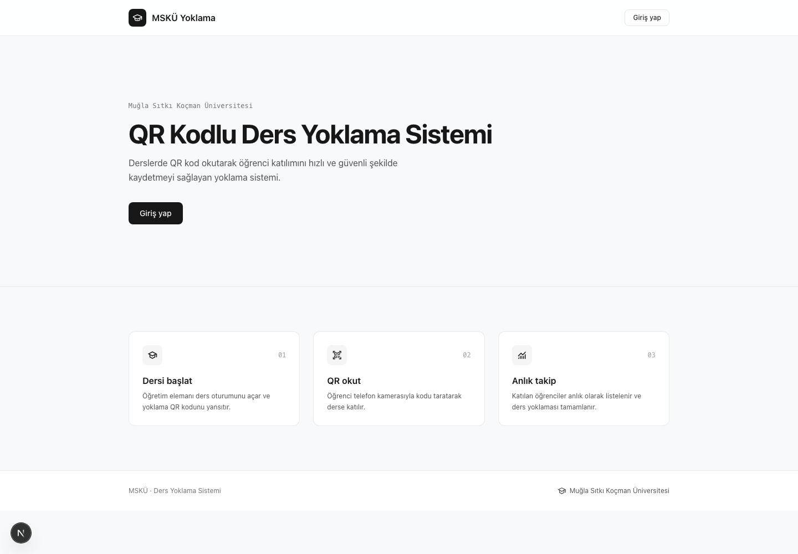
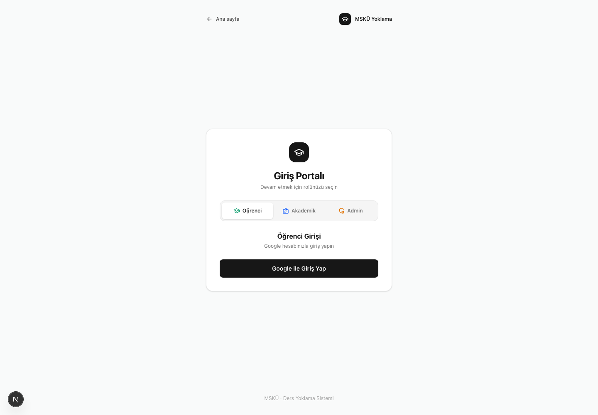

# DersDevam

Muğla Sıtkı Koçman Üniversitesi için geliştirilen; QR kod, okul ağı ve konum
doğrulaması kullanan web tabanlı ders yoklama sistemi.

## Ekran görüntüleri

### Ana sayfa



### Rol tabanlı giriş portalı



## Öne çıkan özellikler

- Öğretmen tarafından başlatılan, 30 saniyede bir yenilenen güvenli QR yoklama
- Öğrenci konumu, okul ağı ve cihaz kimliği kontrolleri
- Öğrenci, akademik personel ve yönetici için ayrı giriş akışları
- Ders, öğrenci listesi, manuel yoklama ve devamsızlık yönetimi
- `.xls` / `.xlsx` öğrenci listesi içe aktarma ve yoklama raporu dışa aktarma
- Anlık katılım takibi, QR tarama kayıtları ve denetim günlüğü
- Mobil öncelikli öğrenci deneyimi

## Mevcut durum

İlk geliştirme dilimi tamamlandı:

- Next.js 16, React 19, TypeScript ve Tailwind CSS proje iskeleti
- Prisma 7 ve PostgreSQL veri modeli ile iki migration
- Auth.js Google OAuth route'u ve JWT oturumundaki `TEACHER` / `STUDENT` rolü
- 30 saniyelik HMAC-SHA256 QR token üretme/doğrulama altyapısı
- Haversine konum ve IPv4/IPv6 CIDR okul ağı kontrolleri
- Haftalık oturum planı hesapları
- Audit log, reddedilen/şüpheli denemeler ve manuel yoklama için veri modelleri
- Token, konum, IP ve planlama mantığı için birim testleri
- Öğretmen sahipliği ve güncel rol kontrolüyle ders CRUD API'leri
- Ders oluşturma, düzenleme ve güvenli silme özellikli öğretmen paneli
- Gerçek PostgreSQL üzerinde ders CRUD entegrasyon testi
- `.xls` ve `.xlsx` öğrenci listeleri için kolon eşleme ve satır bazlı doğrulama
- Yeni/mevcut Enrollment önizlemesi ve transaction tabanlı içe aktarma
- Dosya boyutu/türü sınırı, mükerrer okul numarası kontrolü ve import audit log'u
- Üniversite `Report.xls` düzeninde çok satırlı ders bilgisi, tekrarlanan sayfa başlığı ve `Alış/Ö.Not` desteği
- Öğrenci numarası + ad soyad doğrulamasıyla hesap/ders kaydı eşleştirme ve geçmiş yoklama bağlantısı
- Rol bazlı `/panel` yönlendirmesi ve mobil öncelikli öğrenci paneli
- Animasyonlu, klavye erişilebilir yeni ders ve silme onay pencereleri
- Ders bazlı oturum matrisi, katılım oranı ve zorunlu öğrenci devamsızlık eşiği içeren yoklama raporu

## Yerel kurulum

1. Ortam dosyasını oluşturun:

   ```powershell
   Copy-Item .env.example .env
   ```

2. `.env` içindeki Google OAuth ve güvenlik anahtarlarını gerçek değerlerle değiştirin. Google OAuth callback adresi geliştirme ortamında:

   ```text
   http://localhost:3000/api/auth/callback/google
   ```

3. PostgreSQL'i başlatın:

   ```powershell
   docker compose up -d postgres
   ```

4. Migration'ları uygulayın ve uygulamayı çalıştırın:

   ```powershell
   npx prisma migrate deploy
   npm run dev
   ```

## Doğrulama komutları

```powershell
npm run test
npm run typecheck
npm run lint
npm run build
```

## Önemli veri modeli kararları

- `AttendanceRecord`, henüz Google hesabıyla eşleşmemiş öğrenciler için de manuel yoklama girilebilmesi amacıyla doğrudan `Enrollment` kaydına bağlanır. `studentId` eşleşme tamamlanana kadar boş olabilir.
- Dersin konum, yarıçap ve IP whitelist değerleri oturum açılırken `AttendanceSession` üzerine kopyalanır. Sonradan ders ayarlarının değişmesi geçmiş oturumların doğrulama bağlamını bozmaz.
- Başarısız ve şüpheli taramalar `AttendanceAttempt` içinde tutulur; başarılı tekil yoklama garantisi `AttendanceRecord(sessionId, enrollmentId)` benzersizliğiyle sağlanır.
- Auth.js tarafından yeni oluşturulan kullanıcı güvenli varsayılan olarak `STUDENT` rolünü alır. Öğretmen yetkilendirme akışı sonraki yönetim diliminde eklenecektir.

## Sıradaki geliştirme adımı

Excel rapor dışa aktarma ve öğretmen yetkilendirme yönetimi.

## Excel öğrenci listesi

Öğretmen panelindeki ilgili ders kartından en fazla 5 MB boyutunda `.xls` veya `.xlsx` dosyası yüklenebilir. Sistem başlık satırını ilk 30 satır içinde otomatik bulur. Üniversitenin `Sınav Yoklama Listesi` / `Report.xls` çıktısı doğrudan kabul edilir; ders kodu, şube, program ve öğretim elemanı önizlemede gösterilir.

Alternatif sade şablon:

```text
Adı Soyadı | Öğrenci No | Zorunlu
```

`Adı Soyadı` yerine ayrı `Ad` ve `Soyad` kolonları da kullanılabilir. Zorunluluk kolonu `Zorunlu` veya `Alış/Ö.Not` olabilir; `Evet/Hayır`, `Zorunlu/...` ve `Alttan/...` değerleri tanınır. Dosya önce önizlenir; hatalı satır varsa kaydetme engellenir. Aynı ders ve öğrenci numarası daha önce kayıtlıysa mevcut Enrollment güncellenir.
